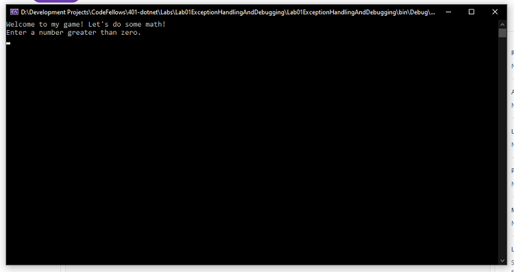
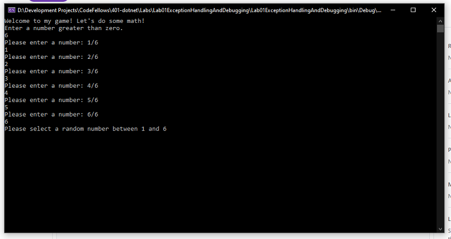
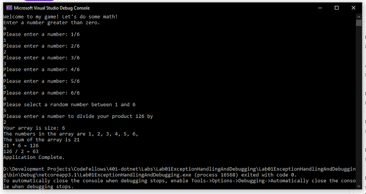

# Lab: 01a - Exception Handling & Debugging

## About Me

*Author: Trevor Stubbs*

----

## Description *TODO*
This is a C# console application that will ask the user to 

---

### Getting Started
Clone this repository to your local machine.

```
$ git clone https://github.com/TrevorStubbs/Lab01ExceptionHandlingAndDebugging.git
```

### To run the program from Visual Studio:
Select ```File``` -> ```Open``` -> ```Project/Solution```

Next navigate to the location you cloned the Repository.

Double click on the ```Lab01ExceptionHandlingAndDebugging``` directory.

Then select and open ```Lab01ExceptionHandlingAndDebugging.sln```

---

### Visuals *TODO*
#### Application Start

#### Using the Application

#### Application End


---

### Change Log
- 1.0: Initial Repo Setup
- 1.1: StartSequence Method Outline Complete
- 1.2: Populate Method Complete
- 1.3: GetSum Method Complete
- 1.4: GetProduct Method Complete
- 1.5: GetQuotient Method Complete
- 1.6: StartSequence Method Complete
- 1.7: Cleanup and Comments